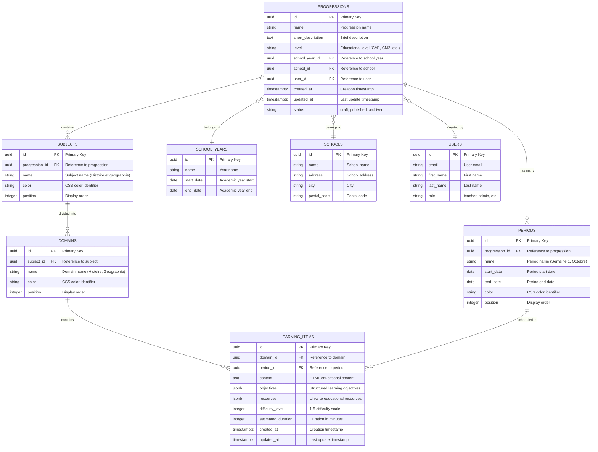
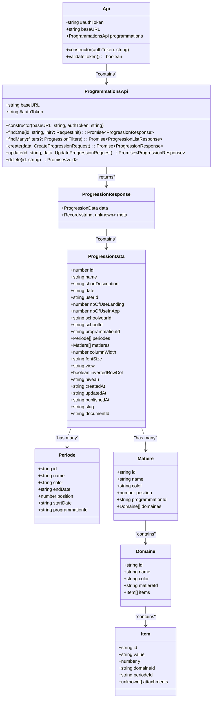
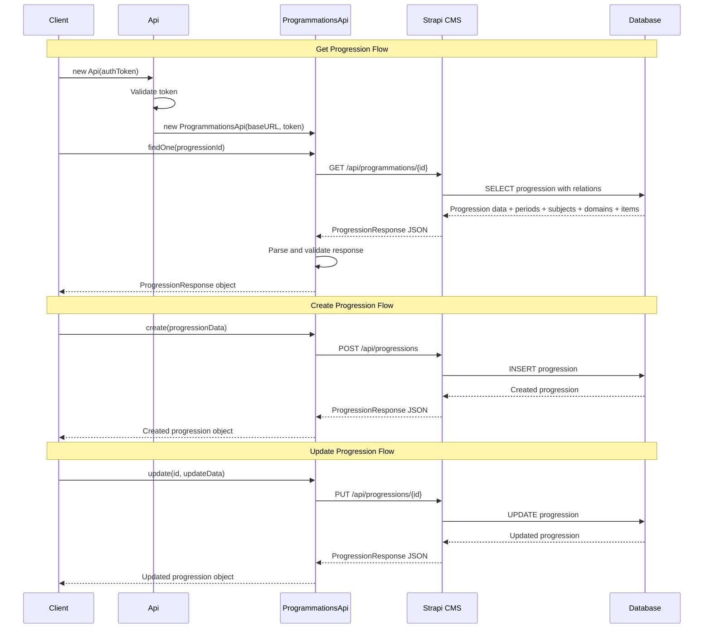
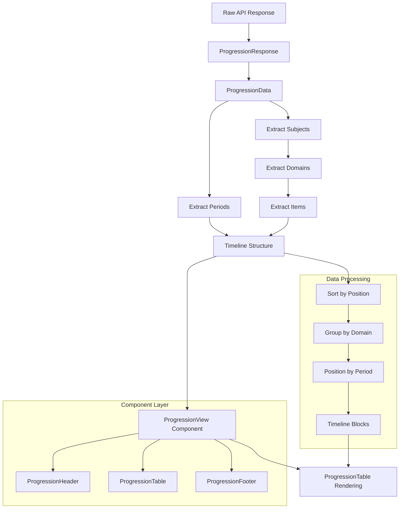
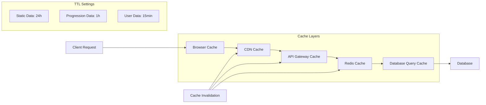

# UML Chart - Database & API Modelization

## Database Entity Relationship Diagram

## API Class Diagram

## API Endpoint Flow Diagram

## Data Transformation Flow

## Database Indexes and Performance

```mermaid
graph TB
    subgraph "Performance Optimizations"
        A[Primary Indexes]
        B[Foreign Key Indexes]
        C[Composite Indexes]
        D[Search Indexes]
    end

    A --> A1["progressions(id)"]
    A --> A2["periods(id)"]
    A --> A3["subjects(id)"]
    A --> A4["domains(id)"]
    A --> A5["learning_items(id)"]

    B --> B1["periods(progression_id)"]
    B --> B2["subjects(progression_id)"]
    B --> B3["domains(subject_id)"]
    B --> B4["learning_items(domain_id)"]
    B --> B5["learning_items(period_id)"]

    C --> C1["learning_items(domain_id, period_id)"]
    C --> C2["periods(progression_id, position)"]
    C --> C3["subjects(progression_id, position)"]

    D --> D1["progressions(name) GIN"]
    D --> D2["learning_items(content) GIN"]
    D --> D3["progressions(level, status)"]
```

## API Response Caching Strategy

## Scalability Considerations

### Horizontal Scaling Points

- **API Server**: Load balancer + multiple instances
- **Database**: Read replicas for queries, master for writes
- **Cache**: Redis Cluster for distributed caching
- **CDN**: Static assets and API responses
- **File Storage**: Separate service for attachments

### Performance Metrics

- **API Response Time**: < 200ms for cached data
- **Database Query Time**: < 50ms for progression queries
- **Concurrent Users**: 1000+ simultaneous users
- **Data Throughput**: 10K+ progressions, 100K+ learning items
