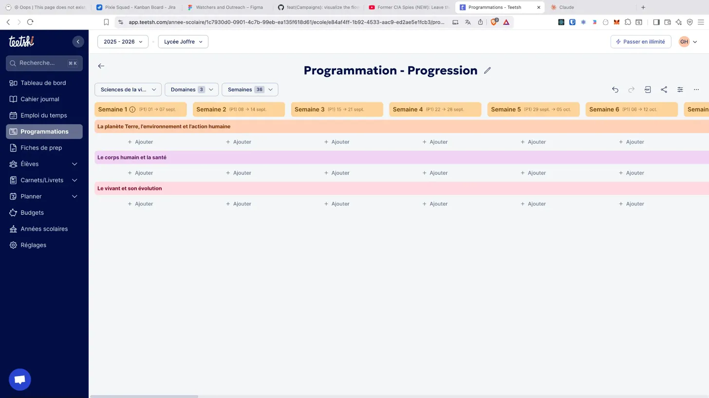

## Contexte

- Une matière (i.e. Français, etc.) est composée de domaines (i.e. langage oral, écriture, etc.)
- L’année est composée de 5 périodes (entre chaque vacance scolaire), elles même composées de semaines (5 à 11 semaines par période)
- Une progression est un document créé par le professeur des écoles pour découper l’enseignement d’une matière ou d’un domaine et la planifier chronologiquement dans l’année, semaine par semaine.
- La progression actuelle est affichée dans l'image ci-dessous :
  

## Problématique

- Quelle serait la meilleure UX / UI pour représenter une progression ? Design une maquette avec React, Typescript, TailwindCSS, et Tanstack Router.

## Tâches

- La progression a afficher est disponible via `/lib/api.ts` (GET /progressions/:id) avec l'id `wwdnw9553da0cdypjq2t9p3f`
- La progression doit être affichée dans une page dédiée.
- La progression doit être responsive (mobile, tablette, desktop).
- La progression doit être accessible (WCAG 2.1 AA).
